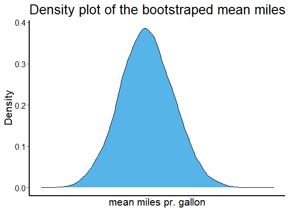

---
title: "Seminar 1"
author: "Eric"
date: "03.11.2022"
output: 
    pdf_document: 
      keep_md: yes
    github_document:
    fig_width: 5
    fig_height: 5
    dev: jpeg
  
---

```{r setup, include=FALSE}
library(tidyverse)
library(extrafont)
#font_import()
loadfonts(device = "win")
knitr::opts_chunk$set(echo = TRUE)
```

# Siste seminar


## Seminar 1: Laste inn og endre data


I løpet av seminaret har vi brukt to metoder for å laste inn data. I starten datasett som allerede var i R, eller i en pakke, og senere gjennom å laste ned datasettene og bruke forskjellige read_* funksjoner. 

```{r, eval= FALSE, message=FALSE, warning=FALSE}
library(rosdata) #Laste inn pakken som gir data fra pensumboken
library(tidyverse)

earnings <- earnings

mineData <- read.csv("mittDatasett.csv")

data("mtcars")

```


Herifra kommer jeg til å bruke mtcars datasettet, ofte brukt som eksempel er det ferdig lasta inn i R fra før. Det er også det jeg har brukt som eksempel i seminarene :) Første vi gjorde på seminar 1 var å undersøke datasettet, lage nye variabler, og lage noen grafer. 

```{r, message=FALSE, warning=FALSE}
mtcars #Ved å bare skrive navnet får jeg se et utdrag av datasettet

mtcars %>% 
  ggplot(aes(disp, mpg, label = rownames(mtcars))) +
  geom_point(colour = "red", size = .5) +
  geom_smooth(method = "lm") +
  geom_text(position = "dodge") +
  ggthemes::theme_economist_white() +
  labs(y = "Miles pr. gallon", x = "Displacement")


mtcars <- mtcars %>% 
  mutate(big_car = ifelse(disp > mean(disp), 1, 0))


```


## Standardfeil, bootstraping, og mer stress

Standardavviket er et mål på spredning, og viser dermed hvor *forskjellige* enhetene i datasettet vårt er. Et større standardavvik vil dermed bety at enhetene oftest er lenger fra gjennomsnittet enn om standardavviket er mindre. 

Det er særlig tre ulike standardavvik som er relevante for oss: 
(1) Standardavviket i populasjonen (typisk ukjent)
(2) Standardavviket i utvalget (kjent)
(3) Standardavviket for utvalgsfordelingen til estimatoren vi bruker – også kalt standardfeil. Denne kan vi komme frem til på en rekke ulike måter (analytisk, via bootstrapping, eller Bayesianske Monte Carlo simuleringer – som vi gjør vi via rstanarm). 

Nr 3. gjør vi i R som oftest bare ved å bruke 'sd()' på variabelen vi er interesert i, eller at det kommer som et resultat av noe annen kode (f.eks. en regresjonsanalyse). Vi kan også gjøre det gjennom bootstrapping, sånn som under.


```{r, warning=FALSE}

#Lager en funksjon som henter ut tilfeldige rader, og regner ut gjennomsnittet av en variabel

bootfun <- function(data){
  n <- length(data)
  boot <- sample(n, replace = TRUE) #Sample with replacement 
  boot_mean <- mean(data[boot])
  return(boot_mean)
  
}

n_sims <- 10000
output <- replicate(n_sims, bootfun(mtcars$mpg))

# Den bootstrappede standardfeilen og gjennomsnittet er:
sd(output)
mean(output)

ggplot(as_tibble(output), aes(value)) +
  geom_density(colour = "black", fill = "#56B4E9") +
  scale_x_continuous(name = "mean miles pr. gallon",
                           breaks = seq(0, 20, 25),
                           limits=c(16, 25)) +
        scale_y_continuous(name = "Density") +
        ggtitle("Density plot of the bootstraped mean miles pr. gallon") +
        theme(axis.line = element_line(size=1, colour = "black"),
              panel.grid.major = element_blank(),
              panel.grid.minor = element_blank(),
              panel.border = element_blank(),
              panel.background = element_blank(),
              plot.title=element_text(size = 20),
              text=element_text(size = 16),
              axis.text.x=element_text(colour="black", size = 12),
              axis.text.y=element_text(colour="black", size = 12))


```




## Regresjonsmodeller! :O


```{r, message=FALSE, warning=FALSE}
library(rstanarm)
library(modelsummary)
#Alle regresjonsmodellene vi kjører følger det samme mønsteret, modellfunksjonen (i.e. stan_glm), og så en formel ala Y ~ X, evt. Y ~ X1 + X2 + X3 + X1:X2....


mod1 <- stan_glm(mpg ~ hp, data = mtcars, refresh = 0)
mod2 <- stan_glm(mpg ~ hp + disp, data = mtcars, refresh = 0)
mod3 <- stan_glm(mpg ~ hp + disp + gear, data = mtcars, refresh = 0)

models <- list(mod1, mod2, mod3)

modelsummary(models, statistic = "mad", title = "Linær regresjon, mpg som avhengig", output = "markdown")

```

Tre modeller, med coeffisienten (median), og MAD_SD (i parantes under) i tabellen.Vi kan se at hestekrefter (hp) generelt fører til en lavere drivstoffeffektivitet, men dette virker ikke å være signifikant (standardavviket er nesten like stor som koeffisienten.) Når vi legger til flere variabler forandrer den seg veldig lite mellom modellene. Displacement, altså størrelse, ser også ut til å ha en negativ effekt, men er også signifikant her. Det kan dermed virke som det har mer å si for drivstoffeffektiviteten enn hestekrefter alene. 


For å gjøre en logistisk regresjon bruker vi pretty much akkurat den samme koden!

```{r}
logit1 <- stan_glm(big_car ~ hp + disp + gear, 
                   family = binomial(link = "logit"), 
                   data = mtcars, refresh = 0)
print(logit1)
```


