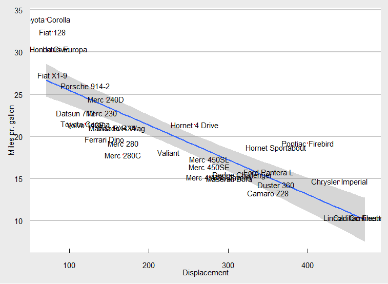
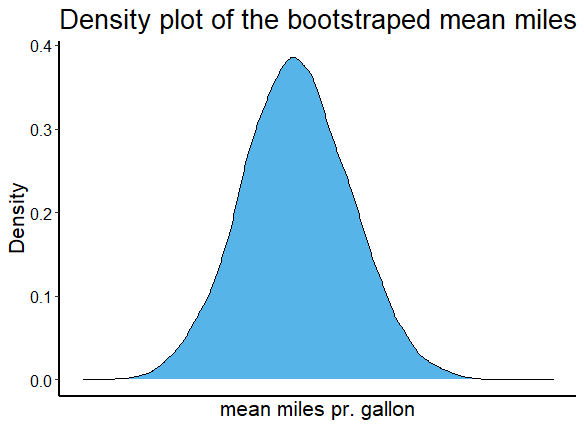
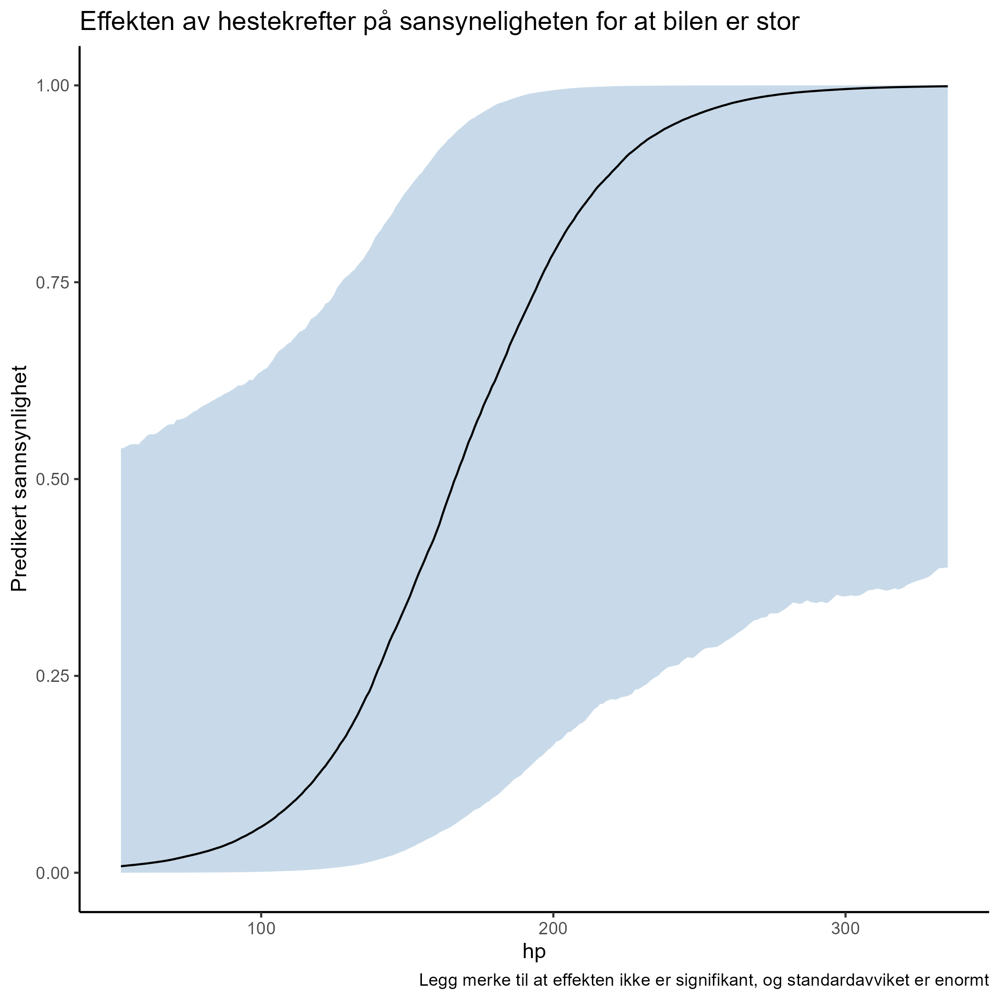
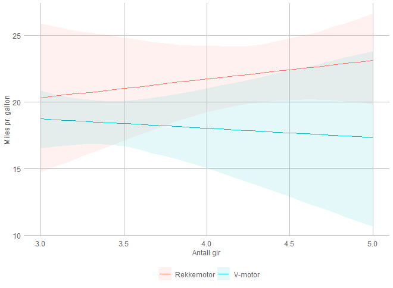

# Siste seminar


## Seminar 1: Laste inn og endre data


I løpet av seminaret har vi brukt to metoder for å laste inn data. I starten datasett som allerede var i R, eller i en pakke, og senere gjennom å laste ned datasettene og bruke forskjellige read\_\* funksjoner.


```r
library(rosdata) #Laste inn pakken som gir data fra pensumboken
library(tidyverse)

earnings <- earnings

mineData <- read.csv("mittDatasett.csv")

data("mtcars")

mtcars_filtered <- mtcars %>% 
  filter(big_car == 1 | gear > 2)

table(mtcars$carb == "")
```

Herifra kommer jeg til å bruke mtcars datasettet, ofte brukt som eksempel er det ferdig lasta inn i R fra før. Det er også det jeg har brukt som eksempel i seminarene :) Første vi gjorde på seminar 1 var å undersøke datasettet, lage nye variabler, og lage noen grafer.


```r
mtcars #Ved å bare skrive navnet får jeg se et utdrag av datasettet
```

```
##                      mpg cyl  disp  hp drat    wt  qsec vs am gear carb
## Mazda RX4           21.0   6 160.0 110 3.90 2.620 16.46  0  1    4    4
## Mazda RX4 Wag       21.0   6 160.0 110 3.90 2.875 17.02  0  1    4    4
## Datsun 710          22.8   4 108.0  93 3.85 2.320 18.61  1  1    4    1
## Hornet 4 Drive      21.4   6 258.0 110 3.08 3.215 19.44  1  0    3    1
## Hornet Sportabout   18.7   8 360.0 175 3.15 3.440 17.02  0  0    3    2
## Valiant             18.1   6 225.0 105 2.76 3.460 20.22  1  0    3    1
## Duster 360          14.3   8 360.0 245 3.21 3.570 15.84  0  0    3    4
## Merc 240D           24.4   4 146.7  62 3.69 3.190 20.00  1  0    4    2
## Merc 230            22.8   4 140.8  95 3.92 3.150 22.90  1  0    4    2
## Merc 280            19.2   6 167.6 123 3.92 3.440 18.30  1  0    4    4
## Merc 280C           17.8   6 167.6 123 3.92 3.440 18.90  1  0    4    4
## Merc 450SE          16.4   8 275.8 180 3.07 4.070 17.40  0  0    3    3
## Merc 450SL          17.3   8 275.8 180 3.07 3.730 17.60  0  0    3    3
## Merc 450SLC         15.2   8 275.8 180 3.07 3.780 18.00  0  0    3    3
## Cadillac Fleetwood  10.4   8 472.0 205 2.93 5.250 17.98  0  0    3    4
## Lincoln Continental 10.4   8 460.0 215 3.00 5.424 17.82  0  0    3    4
## Chrysler Imperial   14.7   8 440.0 230 3.23 5.345 17.42  0  0    3    4
## Fiat 128            32.4   4  78.7  66 4.08 2.200 19.47  1  1    4    1
## Honda Civic         30.4   4  75.7  52 4.93 1.615 18.52  1  1    4    2
## Toyota Corolla      33.9   4  71.1  65 4.22 1.835 19.90  1  1    4    1
## Toyota Corona       21.5   4 120.1  97 3.70 2.465 20.01  1  0    3    1
## Dodge Challenger    15.5   8 318.0 150 2.76 3.520 16.87  0  0    3    2
## AMC Javelin         15.2   8 304.0 150 3.15 3.435 17.30  0  0    3    2
## Camaro Z28          13.3   8 350.0 245 3.73 3.840 15.41  0  0    3    4
## Pontiac Firebird    19.2   8 400.0 175 3.08 3.845 17.05  0  0    3    2
## Fiat X1-9           27.3   4  79.0  66 4.08 1.935 18.90  1  1    4    1
## Porsche 914-2       26.0   4 120.3  91 4.43 2.140 16.70  0  1    5    2
## Lotus Europa        30.4   4  95.1 113 3.77 1.513 16.90  1  1    5    2
## Ford Pantera L      15.8   8 351.0 264 4.22 3.170 14.50  0  1    5    4
## Ferrari Dino        19.7   6 145.0 175 3.62 2.770 15.50  0  1    5    6
## Maserati Bora       15.0   8 301.0 335 3.54 3.570 14.60  0  1    5    8
## Volvo 142E          21.4   4 121.0 109 4.11 2.780 18.60  1  1    4    2
```

```r
mtcars %>% 
  ggplot(aes(disp, mpg, label = rownames(mtcars))) +
  geom_point(colour = "red", size = .5) +
  geom_smooth(method = "lm") +
  geom_text(position = "dodge") +
  ggthemes::theme_economist_white() +
  labs(y = "Miles pr. gallon", x = "Displacement")
```

<!-- --> 

```r
mtcars <- mtcars %>% 
  mutate(big_car = ifelse(disp > mean(disp), 1, 0))
```



## Standardfeil, bootstraping, og mer stress

Standardavviket er et mål på spredning, og viser dermed hvor *forskjellige* enhetene i datasettet vårt er. Et større standardavvik vil dermed bety at enhetene oftest er lenger fra gjennomsnittet enn om standardavviket er mindre.

Det er særlig tre ulike standardavvik som er relevante for oss:

\(1\) Standardavviket i populasjonen (typisk ukjent)

\(2\) Standardavviket i utvalget (kjent)

\(3\) Standardavviket for utvalgsfordelingen til estimatoren vi bruker – også kalt standardfeil. Denne kan vi komme frem til på en rekke ulike måter (analytisk, via bootstrapping, eller Bayesianske Monte Carlo simuleringer – som vi gjør vi via rstanarm).

Nr 3. gjør vi i R som oftest bare ved å bruke 'sd()' på variabelen vi er interesert i, eller at det kommer som et resultat av noe annen kode (f.eks. en regresjonsanalyse). Vi kan også gjøre det gjennom bootstrapping, sånn som under.


```r
#Lager en funksjon som henter ut tilfeldige rader, og regner ut gjennomsnittet av en variabel

bootfun <- function(data){
  n <- length(data)
  boot <- sample(n, replace = TRUE) #Sample with replacement 
  boot_mean <- mean(data[boot])
  return(boot_mean)
  
}

n_sims <- 10000
output <- replicate(n_sims, bootfun(mtcars$mpg))

# Den bootstrappede standardfeilen og gjennomsnittet er:
sd(output)
```

```
## [1] 1.05281
```

```r
mean(output)
```

```
## [1] 20.08962
```

```r
ggplot(as_tibble(output), aes(value)) +
  geom_density(colour = "black", fill = "#56B4E9") +
  scale_x_continuous(name = "mean miles pr. gallon",
                           breaks = seq(0, 20, 25),
                           limits=c(16, 25)) +
        scale_y_continuous(name = "Density") +
        ggtitle("Density plot of the bootstraped mean miles pr. gallon") +
        theme(axis.line = element_line(size=1, colour = "black"),
              panel.grid.major = element_blank(),
              panel.grid.minor = element_blank(),
              panel.border = element_blank(),
              panel.background = element_blank(),
              plot.title=element_text(size = 20),
              text=element_text(size = 16),
              axis.text.x=element_text(colour="black", size = 12),
              axis.text.y=element_text(colour="black", size = 12))
```

<!-- --> 



## Regresjonsmodeller! :O


```r
library(rstanarm)
library(modelsummary)
#Alle regresjonsmodellene vi kjører følger det samme mønsteret, modellfunksjonen (i.e. stan_glm), og så en formel ala Y ~ X, evt. Y ~ X1 + X2 + X3 + X1:X2....


mod1 <- stan_glm(mpg ~ hp, data = mtcars, refresh = 0)
mod2 <- stan_glm(mpg ~ hp + disp, data = mtcars, refresh = 0)
mod3 <- stan_glm(mpg ~ hp + disp + gear, data = mtcars, refresh = 0)

models <- list(mod1, mod2, mod3)

modelsummary(models, statistic = "mad", title = "Linær regresjon, mpg som avhengig", output = "markdown")
```


```
## Warning: 
## `modelsummary` uses the `performance` package to extract goodness-of-fit
## statistics from models of this class. You can specify the statistics you wish
## to compute by supplying a `metrics` argument to `modelsummary`, which will then
## push it forward to `performance`. Acceptable values are: "all", "common",
## "none", or a character vector of metrics names. For example: `modelsummary(mod,
## metrics = c("RMSE", "R2")` Note that some metrics are computationally
## expensive. See `?performance::performance` for details.
##  This warning appears once per session.
```

```
## Warning in !is.null(rmarkdown::metadata$output) && rmarkdown::metadata$output
## %in% : 'length(x) = 5 > 1' in coercion to 'logical(1)'
```


Table: Linær regresjon, mpg som avhengig

|            | Model 1 | Model 2 | Model 3 |
|:-----------|:-------:|:-------:|:-------:|
|(Intercept) | 30.106  | 30.758  | 23.271  |
|            | (1.675) | (1.350) | (4.925) |
|hp          | -0.068  | -0.025  | -0.041  |
|            | (0.011) | (0.014) | (0.017) |
|disp        |         | -0.030  | -0.017  |
|            |         | (0.007) | (0.011) |
|gear        |         |         |  1.853  |
|            |         |         | (1.177) |
|Num.Obs.    |   32    |   32    |   32    |
|R2          |  0.588  |  0.729  |  0.747  |
|R2 Adj.     |  0.543  |  0.703  |  0.724  |
|Log.Lik.    | -88.348 | -81.335 | -80.209 |
|ELPD        |  -91.2  |  -84.4  |  -83.9  |
|ELPD s.e.   |   4.4   |   3.6   |   3.8   |
|LOOIC       |  182.4  |  168.9  |  167.8  |
|LOOIC s.e.  |   8.9   |   7.1   |   7.6   |
|WAIC        |  182.2  |  168.7  |  167.6  |
|RMSE        |  3.74   |  2.98   |  2.84   |

Tre modeller, med coeffisienten (median), og MAD_SD (i parantes under) i tabellen.Vi kan se at hestekrefter (hp) generelt fører til en lavere drivstoffeffektivitet, men dette virker ikke å være signifikant (standardavviket er nesten like stor som koeffisienten.) Når vi legger til flere variabler forandrer den seg veldig lite mellom modellene. Displacement, altså størrelse, ser også ut til å ha en negativ effekt, men er også signifikant her. Det kan dermed virke som det har mer å si for drivstoffeffektiviteten enn hestekrefter alene.

For å gjøre en logistisk regresjon bruker vi pretty much akkurat den samme koden!


```r
logit1 <- stan_glm(big_car ~ hp + disp + gear, 
                   family = binomial(link = "logit"), 
                   data = mtcars, refresh = 0)
print(logit1)
```

```
## stan_glm
##  family:       binomial [logit]
##  formula:      big_car ~ hp + disp + gear
##  observations: 32
##  predictors:   4
## ------
##             Median MAD_SD
## (Intercept) -4.9    6.9  
## hp           0.0    0.0  
## disp         0.0    0.0  
## gear        -2.1    1.7  
## 
## ------
## * For help interpreting the printed output see ?print.stanreg
## * For info on the priors used see ?prior_summary.stanreg
```

Å tolke en logistisk regresjon er litt annerledes enn OLS modellene over. Koeffisientene vi får ut her er på en log-odds skala, som har lite substansiell mening. Det meste vi kan få ut av denne er at "gear" (som et eksempel) har en negativ verdi, men ikke er signifikant (standardavviket/MAD_SD gjør at koefisienten krysser null). Vi kan også se at verdien på den er større enn f.eks. disp, så effekten (hadde den vært signifikant) ville vært sterkere.

Et annet problem er at effekten av en variabel $x_i$ er avhengig av verdien på *alle de andre variablene.* Altså vil effekten av hestekrefter på om bilen er stor være forskjellig når bilen har 2 eller 4 gir. For å tolke modellen regner vi derfor ut marginaleffekten av en variabel, når alle de andre er holdt konstant på en eller annen verdi. Som oftest holder vi de andre på et mål for sentraltendens, f.eks. gjennomsnitt eller median, eller noe annet passende. Så lar vi variabelen vi ønsker å se effekten av variere, dette kaller vi ofte ett scenario.


```r
scenario <- data.frame(
  hp = seq(min(mtcars$hp), max(mtcars$hp)), # Lar antall hestekrefter variere fra minimum til maksimum observert
                       disp = mean(mtcars$disp), #Setter størrelsen på motoren og antal gir på gj.snitt/median
                       gear = median(mtcars$gear)
  )

predikert_utfall <- function(model, scenario){ #Denne lager et datasett som har prediksjonene
  preds <- posterior_epred(model,              # og et konfidensinterval
                           newdata = scenario)
  preds_oppsummert <- apply(preds, 
                            2, FUN = quantile, 
                            probs = c(0.025, 0.5, 0.975))
  out <- as.data.frame(t(preds_oppsummert))
  return(out)
}

prediksjoner <- predikert_utfall(logit1, scenario)

prediksjoner$hp <- seq(min(mtcars$hp), max(mtcars$hp))

ggplot(prediksjoner, 
       aes(x = hp, 
           ymin = `2.5%`, 
           y = `50%`, 
           ymax = `97.5%`))+
  geom_ribbon(alpha = 0.3, fill = "steelblue")+
  geom_line()+
  labs(y = "Predikert sannsynlighet", title = "Effekten av hestekrefter på sansyneligheten for at bilen er stor", caption = "Legg merke til at effekten ikke er signifikant, og standardavviket er enormt")+
  theme_classic()
```



### Interaksjonseffekter

Interaksjonseffekter, eller samspillseffekter, eller samspillsledd (kjært barn har mange navn..) brukes når vi tror at effekten av en variabel avhenger av verdien på en annen. Et eksempel kan være om vi mener at hvor stor effekten antall gir har på drivstoffeffektivitet vil avhengig av om det er en v- eller rekkemotor. For å undersøke dette kan vi se på regresjonsmodellen vi har over, og legge til et samspill mellom *hp* og *vs* (hvor 1 på siste betyr rekkemotor, og 0 v-motor).


```r
mod4 <- stan_glm(mpg ~ hp + disp + gear + am + gear*am, data = mtcars, refresh = 0)
print(mod4)
```


```
## [[1]]
## stan_glm
##  family:       gaussian [identity]
##  formula:      mpg ~ hp + disp + gear + am + gear * am
##  observations: 32
##  predictors:   6
## ------
##             Median MAD_SD
## (Intercept) 30.9    7.2  
## hp           0.0    0.0  
## disp         0.0    0.0  
## gear        -0.7    1.9  
## am          -5.0   10.2  
## gear:am      2.2    2.6  
## 
## Auxiliary parameter(s):
##       Median MAD_SD
## sigma 3.0    0.4   
## 
## ------
## * For help interpreting the printed output see ?print.stanreg
## * For info on the priors used see ?prior_summary.stanreg
```

Her kan vi se at vi har fått en koeffisient for hver av variablene, pluss $gear:am$ som viser samspillsleddet. Når vi nå skal tolke effekten av antall gir, må vi se den sammen med dette leddet. For en bil med rekkemottor vil effekten av antall gir da bli:


```math

Y=gear+gear:am + X +e = + Y = -0,7+2.1(-0.7*1) + X + e

```

altså at effekten av gear er -2.17. For en V motor må du istedet gange -0.7 med 0. Dette kan ofte være lettere å se med en graf:


